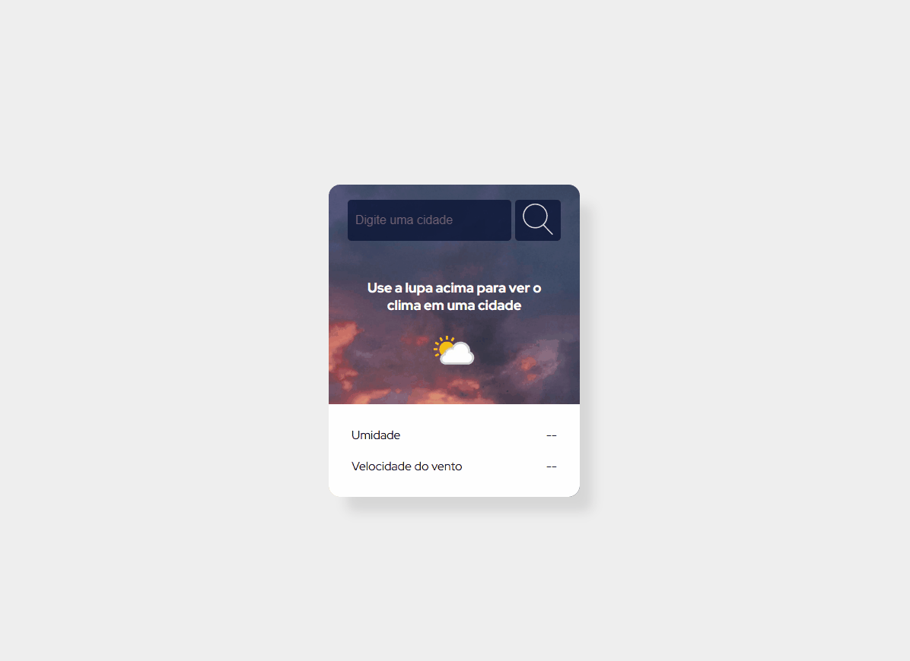

# Projeto Previsão do Tempo

Esse projeto foi desenvolvido durante a live "Black em Dobro" do Dev Em Dobro, na qual eu participei para
poder testar meus conhecimentos.

## Table of contents

- [Visão geral](#visão-geral)
  - [Sobre](#sobre)
  - [Screenshots](#screenshots)
- [Meu processo](#meu-processo)
  - [Dificuldades e aprendizados](#dificuldades-e-aprendizados)
  - [Desenvolvido com](#desenvolvido-com)
- [Autor](#autor)

## Visão geral

### Sobre

O objetivo deste site é fornecer informações sobre o clima da cidade pesquisada pelo usuário

### Screenshots

#### Exemplo do site

## Meu processo

Participei dessa live porque soube que eles iriam consumir uma API de clima, o que despertou meu interesse, já que estou estudando esse tema no momento. Durante a transmissão, apenas acompanhei o desenvolvimento do HTML e CSS, pois já me sinto bastante confiante e confortável com essas tecnologias. Quando chegou o momento de trabalhar com o JavaScript e consumir a API, decidi pausar a live e tentar implementar por conta própria.

### Dificuldades e aprendizados

Consegui fazer a aplicação funcionar sem problemas, exceto na parte de alteração do ícone. Não conhecia o método `setAttribute`, o que me deixou um pouco confuso sobre como passar corretamente o link do ícone. Então, voltei na live e percebi que os gêmeos o haviam utilizado, o que me ajudou a entender como implementá-lo no meu código. Após isso, não tive mais dificuldades. Fiz as alterações sugeridas pelos gêmeos para evitar possíveis erros na aplicação e, por fim, refatorei o código conforme as recomendações deles.

### Desenvolvido com

- HTML5 
- CSS
- Flexbox
- Javascript
- API (WeatherAPI)

## Autor

- GitHub - [itsdavss](https://github.com/itsdavss)
- Meu portfólio - [Davi Oliveira](https://itsdavss.github.io/portfolio-davi/)
- LinkedIn - [Davi Oliveira dos Santos](https://www.linkedin.com/in/davi-oliveira-dos-santos/)
